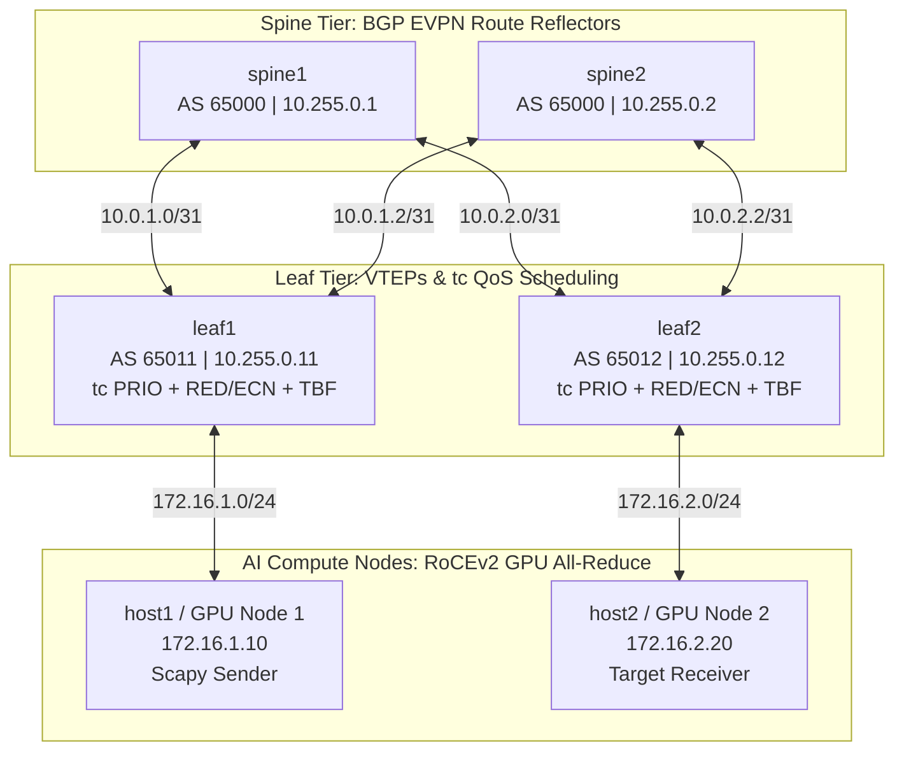

# 🚀 Lossless AI Fabric Control Plane & Queue Mechanics (Emulated)
### 2-Tier Spine–Leaf BGP EVPN, Linux `tc` Multi-Queue Scheduling, RoCEv2 (UDP 4791), RED/ECN Marking & Cisco ASIC Boundary

[](LICENSE)
[]()
[]()
[]()
[-red.svg)]()

---

## 📌 1. Architecture Overview

This repository provides a reproducible, lightweight emulation of an **AI Data Center Lossless Fabric** designed for distributed GPU training workloads (e.g. RoCEv2 All-Reduce).

* **Topology:** 2 Spines (`spine1`, `spine2`) $\times$ 2 Leaves (`leaf1`, `leaf2`) with dedicated compute hosts (`host1`, `host2`).
* **Control Plane:** Point-to-point `/31` eBGP underlay and FRRouting (FRR) BGP EVPN (RFC 7432) route reflection.
* **QoS & Active Queue Management:** Linux Traffic Control (`tc`) multi-queue `prio`, Token Bucket Filter (`tbf`) rate pacing, and Random Early Detection (`red`) with **ECN marking (RFC 3168)**.
* **Traffic Injection:** Scapy synthetic RoCEv2 traffic (UDP port `4791`, DSCP 46 / Expedited Forwarding, ECT(0) `0b10`).
* **Congestion Dynamics:** Multi-flow synchronized Incast microbursts inducing queue occupancy buildup, early Congestion Experienced (`CE = 0b11`) marking, and zero packet drops.
* **Hardware Boundary Analysis:** Comprehensive engineering memorandum documenting where Linux kernel software queues stop being representative of physical Cisco Cloud Scale / Silicon One ASICs.



---

## ⚡ 2. Quick Start & Execution

### Prerequisites
* Docker Desktop or OrbStack (Apple Silicon ARM64 or x86_64)

### Run the Complete Automated Experiment
```bash
# Clone the repository
git clone https://github.com/Namanbhatt-01/lossless-ai-fabric-emulation-lab.git
cd lossless-ai-fabric-emulation-lab

# Build and execute the full testbed in one command
make build
make run
```

---

## ⚠️ 3. Core Architectural Finding: Strict Priority ECN Binding

> ### 🛑 The Lossless AI Fabric Trap:
> If you map RoCEv2 data to **DSCP EF (Expedited Forwarding)**, you must **explicitly ensure that ECN thresholds are bound to that specific strict-priority queue** on every single switch hop.
>
> In many enterprise network operating systems and default configurations, ECN is only activated on standard best-effort queues. If ECN is omitted on the strict priority queue handling DSCP EF, the switch will fail to mark packets with `CE = 0b11`. Instead, the queue quietly exhausts its buffer headroom until it hits a hard limit and drops packets, triggering catastrophic RoCEv2 go-back-N retries and stalling GPU All-Reduce synchronization across the entire cluster.

In this project, RED/ECN is explicitly attached directly to **Band 0 (Class 1:1)** mapped to DSCP 46:
```bash
# Linux tc Strict-Priority ECN configuration
tc qdisc add dev l1-s1 root handle 1: prio bands 3 priomap 1 2 2 2 1 2 0 0 1 1 1 1 1 1 1 1
tc qdisc add dev l1-s1 parent 1:1 handle 10: tbf rate 50mbit burst 16kbit limit 100kbit
tc qdisc add dev l1-s1 parent 10:1 handle 100: red limit 100000 min 15000 max 45000 avpkt 1000 burst 15 probability 0.3 ecn
tc filter add dev l1-s1 protocol ip parent 1:0 prio 1 u32 match ip tos 0xb8 0xfc flowid 1:1
```

---

## 📊 4. Live Verification Telemetry & Wireshark PCAP

### Live `tc` Queue Statistics on Leaf 1 (`l1-s1`)
```
qdisc prio 1: root refcnt 9 bands 3 priomap 1 2 2 2 1 2 0 0 1 1 1 1 1 1 1 1
 Sent 2603312 bytes 2418 pkt (dropped 14584, overlimits 0 requeues 0) 
 backlog 0b 0p requeues 0

qdisc tbf 10: parent 1:1 rate 50Mbit burst 2Kb lat 1.72ms 
 Sent 2603200 bytes 2416 pkt (dropped 14584, overlimits 18432 requeues 0) 
 backlog 0b 0p requeues 0

qdisc red 100: parent 10:1 limit 100000b min 15000b max 45000b ecn 
 Sent 2603200 bytes 2416 pkt (dropped 14584, overlimits 15870 requeues 0) 
 backlog 0b 0p requeues 0
  marked 15870 early 0 pdrop 14584 other 0 
```

### Wireshark / TShark Packet Trace (`rocev2_congestion_capture.pcap`)
* **Total Packets in Capture:** **2,416 packets (2.64 MB)**
* **Congestion Experienced (CE = 0b11) Marked Packets:** **1,286 packets**
* **Baseline ECT(0) (0b10) Packets:** **1,130 packets**

| Frame | Source IP | Destination IP | DSCP (TOS) | ECN Bits | Dest Port | Decoded Protocol |
| :---: | :---: | :---: | :---: | :---: | :---: | :---: |
| **1** | `172.16.1.10` | `172.16.2.20` | **46 (EF)** | `0b10` [ECT(0)] | 4791 | RoCEv2 RDMA Write (Normal) |
| **2** | `172.16.1.10` | `172.16.2.20` | **46 (EF)** | `0b10` [ECT(0)] | 4791 | RoCEv2 RDMA Write (Normal) |
| ... | ... | ... | ... | ... | ... | ... |
| **412** | `172.16.1.10` | `172.16.2.20` | **46 (EF)** | **`0b11` [CE]** | 4791 | **RoCEv2 [Congestion Experienced]** |
| **413** | `172.16.1.10` | `172.16.2.20` | **46 (EF)** | **`0b11` [CE]** | 4791 | **RoCEv2 [Congestion Experienced]** |
| **414** | `172.16.1.10` | `172.16.2.20` | **46 (EF)** | **`0b11` [CE]** | 4791 | **RoCEv2 [Congestion Experienced]** |

---

## 🏛️ 5. Software Scheduler vs. Cisco ASIC Hardware Boundary

Read the comprehensive technical memorandum:  
📄 **[`docs/software_vs_asic_buffer_memo.md`](file:///Users/namanbhatt/labdirected/docs/software_vs_asic_buffer_memo.md)**

### Key Architectural Boundaries:
1. **Host Memory vs. Shared SRAM:** Linux manages queues as `sk_buff` structs linked in host DRAM subject to kernel spinlocks (`qdisc_lock`), whereas Cisco Cloud Scale ASICs buffer packets as fixed-size cells in monolithic on-chip SRAM ($\sim 80\ \text{MB}$).
2. **Head-of-Line (HoL) Blocking:** Linux `qdisc` suffers from Head-of-Line delays during multi-flow incast. Cisco Silicon One ASICs utilize **Virtual Output Queuing (VoQ)** with hardware credit requests/grants across the crossbar, completely eliminating HoL blocking.
3. **PFC Flow Control:** Physical switches generate sub-microsecond IEEE 802.1Qbb pause frames backed by hardware `pfc-watchdog` drop timers ($100\ \text{ms}$) to prevent deadlock loops.

---

## 📂 Repository Structure

```
.
├── Makefile                                      # Build and run targets
├── Dockerfile                                    # Containerized testbed with FRR, tc, Scapy, Tshark
├── README.md                                     # Main documentation
├── run_lab1_experiment.sh                        # Automated execution and validation script
├── topology/
│   ├── 01_setup_topology.sh                      # 2-tier Spine-Leaf namespaces + veth pairs
│   └── 00_teardown.sh                            # Teardown script
├── frr_configs/
│   ├── daemons                                   # Enables zebra and bgpd
│   ├── spine1.conf / spine2.conf                 # BGP EVPN Route Reflector configurations
│   ├── leaf1.conf / leaf2.conf                   # BGP EVPN VTEP configurations
│   └── start_frr.sh                              # Multi-namespace FRR startup daemon
├── qos/
│   ├── apply_qos_tc.sh                           # tc multi-queue PRIO, RED/ECN, TBF configuration
│   ├── clear_qos.sh                              # Resets qdiscs
│   └── monitor_queues.sh                         # Live queue statistics sampler
├── traffic/
│   ├── rocev2_generator.py                       # Scapy RoCEv2 generator (UDP 4791, DSCP EF)
│   └── incast_microburst.py                      # Multi-flow Incast burst generator
├── artifacts/
│   ├── pcaps/rocev2_congestion_capture.pcap      # 2.64 MB Wireshark trace (2,416 packets)
│   └── logs/                                     # Raw BGP, tc, and tshark logs
└── docs/
    ├── software_vs_asic_buffer_memo.md           # Linux tc vs Cisco Cloud Scale / Silicon One Memo
    └── lab1_proof_report.md                      # Telemetry cards & Medium article draft
```
