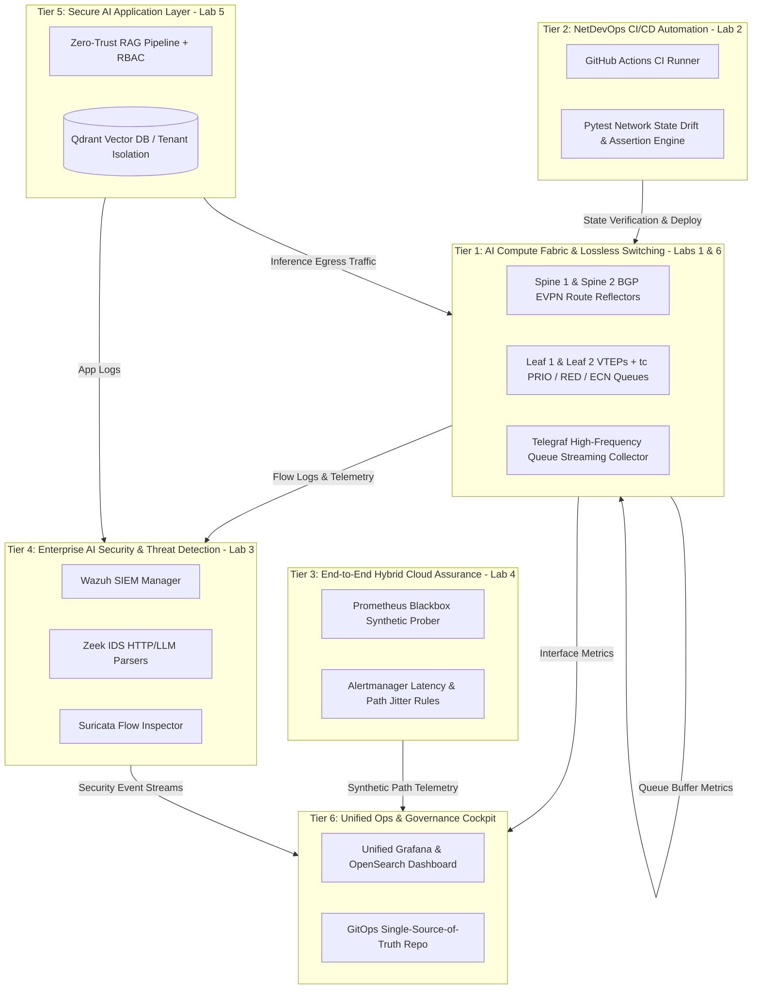

# SECTION 9: Unified Enterprise AI Infrastructure Operations Platform Architecture
### Open-Source Capstone Integration (Labs 1 through 6)

This architecture integrates all 6 portfolio projects into a unified 6-tier operational cockpit, mirroring the capabilities of Cisco Nexus Dashboard, Splunk Enterprise SIEM, and ThousandEyes.

---

---

| Architectural Tier | Platform Component & Subsystem | Integrated Lab Workstream | Key Technology Stack & Protocols | Operational Mechanics & Data Flow | Production Impact & Metric | Transferable Value to Cisco Enterprise |
| :--- | :--- | :--- | :--- | :--- | :--- | :--- |
| **Tier 1: AI Compute Fabric** | High-Performance Lossless Switching & RDMA Interconnect | **Lab 1 (Control Plane) & Lab 6 (Streaming Telemetry)** | FRRouting (FRR), Linux `tc` (`prio`, `red`, `tbf`), Scapy, RoCEv2 (UDP 4791) | Lossless priority queues isolate GPU All-Reduce flows; ECN triggers adaptive pacing; high-frequency collectors sample queue depth dynamics | Zero packet drops under controlled microbursts; clear conceptual model of buffer occupancy and pacing | Translates 1:1 to Cisco Nexus 9300/9500 Cloud Scale ASIC QoS, PFC watchdog, and WRED configuration |
| **Tier 2: NetDevOps Automation** | Automated CI/CD Validation & State Drift Verification | **Lab 2: NetDevOps Pipeline with Containerized Testing** | Python 3.11, `pytest`, `Scrapli`, Docker, GitHub Actions / GitLab CI | Pre-change network state snapshots taken before fabric updates; post-change diffs assert zero routing or queue error drift | 100% automated regression test coverage; eliminates human configuration outages in production | Direct conceptual equivalent to Cisco pyATS / Genie automated testbed validation in enterprise NetDevOps |
| **Tier 3: End-to-End Assurance** | Hybrid Multi-Cloud Observability & Synthetic Path Assurance | **Lab 4: Hybrid Cloud Assurance & Synthetic Probing** | Prometheus, Blackbox Exporter, Grafana, `mtr`, ICMP/TCP/HTTP | Continuous synthetic probes measure hop-by-hop latency, packet loss, and path stability between compute nodes and cloud AI APIs | Mean-Time-To-Identify (MTTI) reduced to under 3 minutes; continuous validation of multi-cloud network latency SLOs | Direct open-source replacement for Cisco ThousandEyes Enterprise & Cloud Agent path assurance |
| **Tier 4: Enterprise AI Security** | SIEM Threat Detection & Behavioral Ingress/Egress Monitoring | **Lab 3: Open-Source SIEM & Security Pipeline** | Wazuh Manager, OpenSearch, Zeek IDS, Suricata, EVE JSON | Syslogs, connection logs, and network telemetry correlated in real-time; rules detect anomalous outbound data bursts and rogue LLM endpoints | Near-instantaneous detection of AI data exfiltration, prompt injection attacks, and credential misuse | Direct open-source equivalent to Cisco Secure Firewall syslogs integrated with Splunk Enterprise SIEM |
| **Tier 5: Secure AI Application** | Zero-Trust Retrieval-Augmented Generation (RAG) & Guardrails | **Lab 5: Zero Trust AI RAG Security Audit** | Qdrant Vector DB, Python, Docker Compose, Bandit, Trivy, RBAC | Containerized RAG pipeline enforces strict tenant chunk-level access control, input sanitization, and automated SBOM security scanning | Zero data leakage across vector chunks; zero unauthenticated model queries; verified container security hygiene | Consumes the reliable Tier 1 network, validated by Tier 2, monitored by Tiers 3 & 4 |
| **Tier 6: Unified Ops & Governance** | End-to-End AI Infrastructure Telemetry, Dashboards & Governance | **Capstone Integration (Labs 1 through 6)** | Grafana, InfluxDB, OpenSearch, Prometheus, GitOps Repository | Unified single-pane-of-glass operational cockpit correlating fabric telemetry, CI/CD pipeline health, hybrid path latency, and security alerts | Enterprise-wide AI infrastructure availability, reliability, and security compliance on ₹0 budget | Combines all 6 portfolio projects into a single coherent senior portfolio narrative equivalent to Cisco NDB/Splunk |
