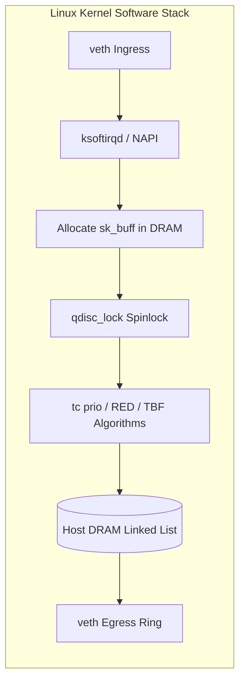
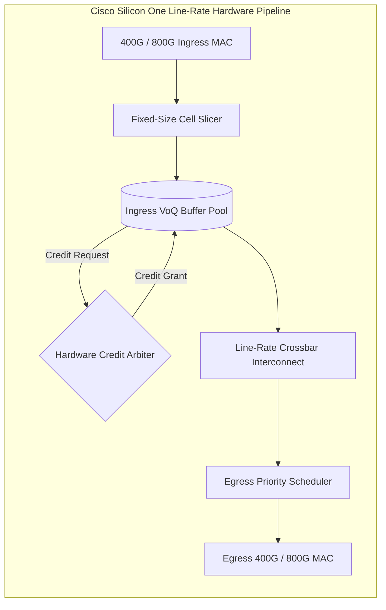

# Engineering Memorandum: Linux Kernel Queue Scheduling vs. Cisco Cloud Scale & Silicon One ASIC Buffer Dynamics

**To:** AI Infrastructure Architecture & Networking Systems Team  
**From:** Infrastructure & Fabric Performance Engineer  
**Date:** September 2026  
**Subject:** Rigorous Architectural Boundary Analysis: Linux `tc` Software Emulation vs. Physical Cisco Cloud Scale / Silicon One Line-Rate ASICs

---

## 1. Executive Summary

This memorandum formally establishes the technical boundaries between the software-emulated queue mechanics implemented in **Lab 1** (using Linux kernel `tc`, network namespaces, and veth pairs) and the physical hardware packet processing pipeline executed on **Cisco Nexus 9000 (Cloud Scale)** and **Cisco Silicon One ASICs**.

While Linux `tc` accurately models the mathematical principles of **Active Queue Management (AQM)**, **Random Early Detection (RED)**, and **Explicit Congestion Notification (ECN marking per RFC 3168)**, it is fundamentally decoupled from the hardware microarchitecture governing line-rate packet buffering, Virtual Output Queuing (VoQ), and nanosecond-level buffer arbitration.

---

## 2. Comparative Architecture Matrix

| Architectural Dimension | Linux Kernel Software (`tc` / `qdisc`) | Cisco Cloud Scale ASIC (Nexus 9300/9500) | Cisco Silicon One ASIC (G100 / G200 / P100) |
| :--- | :--- | :--- | :--- |
| **Datapath Location** | Host Operating System Kernel Space | Dedicated Monolithic On-Chip SRAM | Unified High-Bandwidth Memory (HBM) + On-Die Buffer Pool |
| **Switching Latency** | $\sim 5 - 25\ \mu\text{s}$ (CPU context switches, softirqs) | $350 - 900\ \text{ns}$ (Cut-through line-rate) | $400 - 800\ \text{ns}$ (Fully distributed cut-through) |
| **Buffer Architecture** | Host DRAM linked lists (`sk_buff` structs) | Centralized / Shared High-Bandwidth SRAM ($\sim 40\text{--}80\text{ MB}$) | Fully Distributed Virtual Output Queuing (VoQ) Architecture |
| **Congestion Arbitration** | Software timer callbacks & softirqs | Hardware cell-based dynamic buffer allocation | Hardware grant-request VoQ fabric credit system |
| **PFC Execution** | Emulated / Software flow control | Hardware MAC-level Pause frame generation (<100 ns) | Hardware packet-level ingress buffer backpressure |
| **Head-of-Line (HoL) Blocking** | Highly susceptible under single-queue lock | Mitigated via per-port/per-priority dedicated queues | **Completely eliminated** via ingress VoQ architecture |
| **ECN Marking Precision** | Coarse software timer resolution ($>1\ \text{ms}$) | Hardware line-rate threshold check ($\pm 1\ \text{cell}$) | Sub-microsecond instantaneous queue depth trigger |

---

## 3. Microarchitectural Deep-Dive

### 3.1 Linux Kernel Datapath (`sk_buff` and `qdisc`)
1. **Memory Allocation Overhead:** Every packet in Linux is encapsulated in a dynamically allocated `struct sk_buff`. Allocating, linking, and freeing `sk_buff` structures incurs significant CPU cache churn and DRAM memory bus transactions.
2. **Software Lock Contention:** The Linux `qdisc` layer requires spinlocks (e.g., `qdisc_lock`) per network interface or per sub-queue. Under heavy multi-core transmit workloads, lock contention creates severe CPU jitter and false queue latency spikes.
3. **Queue Incast Behavior:** When multiple veth interfaces transmit simultaneously, the host CPU softirq handler (`ksoftirqd`) schedules processing across available cores. Incast microbursts are smoothed or exacerbated by host OS CPU scheduling priorities rather than purely physical link congestion.

---

### 3.2 Cisco Cloud Scale & Silicon One Hardware ASICs
1. **Cell-Based Shared Memory (Cloud Scale):** Cisco Cloud Scale ASICs carve incoming packets into fixed-size hardware cells (e.g., 208-byte or 256-byte cells) stored in ultra-high-speed on-chip SRAM. Buffer pointers, not packet payloads, are queued across ingress/egress pipelines.
2. **Virtual Output Queuing (Silicon One):**
   * Packets arriving at an ingress port destined for a congested egress port are buffered **at the ingress VoQ buffer**, not at the egress switch fabric interface.
   * Ingress packet schedulers send lightweight hardware **Credit Requests** across the crossbar.
   * The egress arbiter issues **Credit Grants** only when egress line capacity is available.
   * **Result:** Heavy congestion on Port A $\to$ Port B never starves or delays traffic flowing from Port A $\to$ Port C, eliminating Head-of-Line (HoL) blocking entirely.

---

## 4. Lossless Fabric Congestion Mechanics: ECN & PFC Interaction

### 4.1 The Dual-Threshold Buffer Model
In a production AI training cluster (RoCEv2 / GPU All-Reduce), buffer headroom is tuned with extreme mathematical precision:

$$\text{Buffer Depth} = \text{Ingress Headroom} + \text{Shared Buffer Pool} + \text{Dedicated Queue Quota}$$

* **ECN Marking Threshold ($K_{min} / K_{max}$):** Triggered early (e.g., at 20%–40% buffer occupancy) to mark Congestion Experienced (`CE = 0b11`) bits without dropping packets, instructing the sender NIC to throttle its transmission rate (via CNP - Congestion Notification Packets).
* **PFC Generation Threshold ($T_{PFC}$):** Set significantly higher (e.g., 75%–85% occupancy) as an emergency backpressure mechanism. If ECN fails to reduce the rate quickly enough, the switch transmits IEEE 802.1Qbb Priority Flow Control (PFC) pause frames to upstream nodes.

### 4.2 PFC Deadlock & Watchdog Dynamics
* **PFC Deadlock:** If cyclic dependencies exist across multi-hop Spine-Leaf topologies (e.g., Buffer A pauses Buffer B, which in turn pauses Buffer A), the fabric enters a permanent deadlock state where all buffers freeze.
* **Cisco Solution:** Hardware `pfc-watchdog` monitors the duration an egress queue remains in a paused state. If the pause duration exceeds a strict threshold (e.g., $100\ \text{ms}$), the ASIC automatically unjams the pipeline by dropping the paused queue packets, triggering telemetry alarms.
* **Software Emulation Limit:** Linux kernel namespaces and veth pairs cannot natively simulate PHY-layer pause frames or hardware crossbar deadlock loops.

---

## 5. Conclusion & Takeaway

Lab 1 successfully models the **control plane** (BGP EVPN, VTEP discovery, Route Reflection) and the **queue management mathematical logic** (multi-priority classification, early marking thresholds, rate shaping). However, engineering decisions regarding buffer headroom sizing, cut-through latency budgeting, and VoQ credit arbitration must always be validated against physical ASIC hardware datasheets and switch telemetry.
